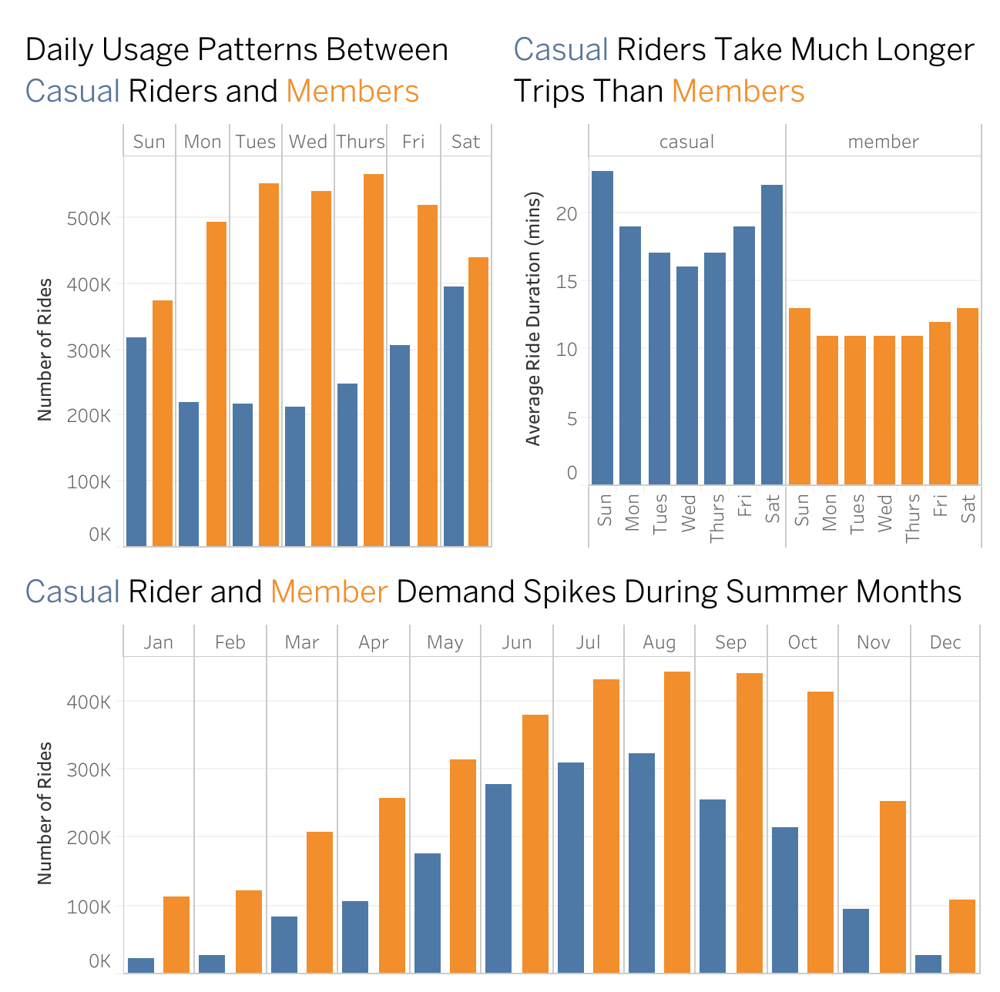

**CASE STUDY OF CYCLISTIC BIKE-SHARE ANALYSIS**

**Introduction**

This repository contains my analysis for the Google Data Analytics Professional Certificate Capstone Project. The goal is to provide data-driven recommendations to help the Cyclistic marketing team convert casual riders into annual members.

**Project Overview**

Cyclistic is a fictional bike-share program in Chicago. The marketing director believes that maximizing the number of annual members is the key to future growth. My task is to analyze how casual riders and annual members use Cyclistic bikes differently.



**Tools Used**

Data Cleaning: SQL BigQuery
Analysis: SQL BigQuery
Visualization: Tableau
Documentation: GitHub

**Data Source**

[Link to the Divvy Dataset Here](https://divvy-tripdata.s3.amazonaws.com/index.html)

**The Data Analysis Process**

1. Ask

Business Task: Analyze how annual members and casual riders use Cyclistic bikes differently in order to identify insights that can help convert casual riders into annual members.

Key Stakeholders: Director of Marketing, Marketing Analytics Team, Cyclistic Executives.

2. Prepare

Data is stored in CSV files.
I used the last 12 months of data (Jan 2025 - Dec 2025).
Data has been verified for integrity (checked for missing values, duplicates, and outliers).

3. Process

Major Cleaning Step: I combined 12 individual monthly datasets into a single year-long table using UNION ALL. I then filtered out "false starts" by removing any trips with a duration of less than or equal to zero and trips greater than 24 hours to ensure the data was not skewed by technical errors or unreturned bikes.

Creating New Columns: I used the TIMESTAMP_DIFF function to calculate ride_length_mins. To enable time-based analysis, I utilized EXTRACT and FORMAT_DATE functions to create day_of_week and month columns, allowing me to compare usage patterns across different timeframes.

***Sample Cleaning and Transformation Query***

```sql

CREATE TABLE `case-study-2025-483513.cyclistic_cs.2025_full_year_cleaned` AS
SELECT 
--Standardizing data and creating time-based features
  FORMAT_TIMESTAMP('%Y-%m-%d %H:%M:%S', started_at) AS started_at,
  FORMAT_TIMESTAMP('%Y-%m-%d %H:%M:%S', ended_at) AS ended_at,
--Calculating ride length in minutes by getting the timestamp difference
  TIMESTAMP_DIFF(ended_at, started_at, MINUTE) AS ride_length_mins,
--Extracting day and month for seasonality analysis
  EXTRACT(DAYOFWEEK FROM started_at) AS day_of_week_num,
  FORMAT_DATE('%A', started_at) AS day_of_week_name,
  EXTRACT(MONTH FROM started_at) AS month_num,
  FORMAT_DATE('%B', DATE(started_at)) AS month_name
FROM `case-study-2025-483513.cyclistic_cs.2025_full_year`
--Filtering out trip errors and outliers
WHERE TIMESTAMP_DIFF(ended_at, started_at, MINUTE) > 0 AND
  TIMESTAMP_DIFF(ended_at, started_at, MINUTE) < 1440
  AND member_casual IS NOT NULL
  AND member_casual != ' '
ORDER BY ride_length_mins DESC;

```

4. Analyze

Key findings from the analysis:

Daily Patterns: Members show consistent, shorter trips during the work week (suggesting commuting), while casual riders peak on weekends with significantly longer durations (suggesting leisure).

Seasonal Patterns: There is a massive spike in casual rider usage during the summer months, whereas member usage remains more stable throughout the year.

5. Share

[View my Tableau Public Viz](https://public.tableau.com/app/profile/arrenz.gorgonia/viz/CyclisticCaseStudy_17683116030960/DataViz?publish=yes)

6. Act

Top 3 Recommendations:

Targeted Weekend Promotions: Offer "Weekend-only" memberships or discounts to casual riders who frequently use the service on Saturdays and Sundays.

Seasonal Benefits: Since casual usage peaks in summer, offer a "Summer Member Pass" to bridge the gap toward an annual subscription.

Duration-Based Incentives: Target casual riders who exceed 20+ minutes per ride with "Member Savings" alerts, showing how an annual plan eliminates high per-minute fees.

